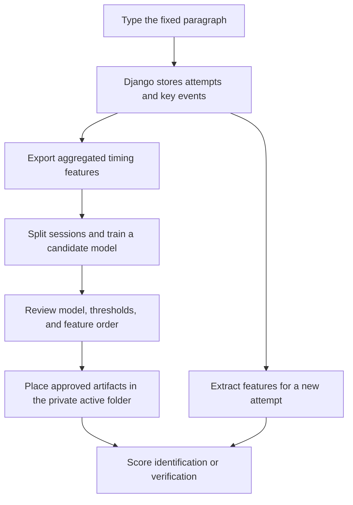

# Keystroke Dynamics Authentication — Paragraph Prototype

A Django research prototype that records how a person types a fixed Turkish paragraph and explores two related tasks:

- **Identification:** predict which enrolled person produced a typing sample.
- **Verification:** compare a typing sample with a claimed enrolled identity and make an accept/reject decision using a class score and a threshold.

This repository includes the web application, feature extraction code, a **synthetic** example dataset, and a public Random Forest training notebook. The original participants' records, application database, fitted models, and calibrated thresholds are private and are **not** included. Consequently, a fresh clone can demonstrate data collection and the example training workflow, but cannot authenticate a real person without separately collected and validated private artifacts.

> **Scope:** The tested workflow used the paragraph task. A word typing route is present in the code, but the word verification experiment was not part of the reported participant tests. “Continuous authentication” describes the broader research topic; the current paragraph demo evaluates completed typing attempts, rather than continuously authenticating someone throughout an arbitrary session.

## Project poster

[View the public project poster (PDF)](docs/poster/paragraph-keystroke-verification-poster.pdf)

The poster summarizes the fixed-paragraph prototype and its future goal of continuous authentication. Its ExtraTrees confusion matrix comes from an exploratory offline identification experiment; the paragraph verification prototype uses a Random Forest model.

## How the prototype works



The browser collects key event data; `collector/views.py` processes attempts and performs model inference. The HTML pages display the returned decision; they do not determine whether a claimant is genuine.

## Repository layout

| Path | Purpose |
| --- | --- |
| `collector/` | Django models, collection endpoints, feature extraction, authentication logic, and management commands. |
| `keystroke_site/` | Django settings and URL routing. |
| `templates/` and `static/css/` | Typing, identification, and verification interfaces. |
| `training/preprocess_paragraph.py` | Historical paragraph preprocessing script; review its inputs and options before running it on newly collected data. |
| `training/preprocess_features.py` | Separate preprocessing path for the word task. |
| `notebooks/train_paragraph_rf_public.ipynb` | Output-free training example using the synthetic paragraph CSV. |
| `notebooks/compare_paragraph_classifiers_public.ipynb` | Output-free comparison of 16 classifier choices using the synthetic paragraph CSV; 14 can run with the example's limited training data. |
| `sample_data/raw/aggregated_paragraph.csv` | Invented, aggregated feature rows for 15 example identities and two sessions per identity. These are **not** original key event logs. |
| `sample_data/processed/processed_paragraph.csv` | Invented example after filling missing features and scaling with session 1 parameters. Provided to illustrate the file layout; the public notebook reads the aggregated CSV instead. |
| `sample_data/README.txt` | Notes on the bundled example data. |
| `data/`, `db.sqlite3`, `training/models/`, `training/experiments/`, `training/metrics/` | Local/private data and generated artifacts excluded from Git. |

## Requirements and local setup (Windows PowerShell)

- Python 3.13, as used in the tested local environment.
- A local installation of Git and, to run the training example, Jupyter Notebook or JupyterLab. Jupyter itself is not listed in `requirements.txt`; install it separately in your preferred notebook environment if needed.
- The packages in `requirements.txt` (including Django, pandas, NumPy, and scikit-learn).

From the folder that contains `manage.py`:

```powershell
py -3.13 -m venv .venv-github
& .\.venv-github\Scripts\python.exe -m pip install -r requirements.txt
```

The Django settings read `DJANGO_SECRET_KEY` from the process environment. Generate a **local** development key for the current PowerShell session; do not commit or paste its value into this repository:

```powershell
$env:DJANGO_SECRET_KEY = & .\.venv-github\Scripts\python.exe -c "from django.core.management.utils import get_random_secret_key; print(get_random_secret_key())"
& .\.venv-github\Scripts\python.exe manage.py check
& .\.venv-github\Scripts\python.exe manage.py migrate
& .\.venv-github\Scripts\python.exe manage.py runserver 8001
```

Open `http://127.0.0.1:8001/`. The root redirects to the word typing page; the paragraph collection page is at `http://127.0.0.1:8001/type/paragraph/`. Paragraph identification and verification pages are at `/auth/paragraph/` and `/auth/paragraph/verify/` respectively. Their model-backed decisions require the separate private files described below.

PowerShell environment variables set with `$env:` last only for the current terminal session. On a later session, set `DJANGO_SECRET_KEY` again before running Django. An empty new database is normal after `migrate`. `manage.py check` checks Django configuration; it does **not** verify that a model and its thresholds are present.

## Training example supplied with the repository

The example notebook uses `sample_data/raw/aggregated_paragraph.csv`. Launch Jupyter from the repository root or `notebooks/`, open `notebooks/train_paragraph_rf_public.ipynb`, then run the cells in order. For example, if Jupyter is already installed in the project environment:

```powershell
& .\.venv-github\Scripts\python.exe -m notebook
```

If that command reports that `notebook` is missing, install or launch your chosen Jupyter interface separately. The public notebook:

1. Loads aggregated feature rows and labels.
2. Uses collection session 1 for model fitting and session 2 for a small identification illustration.
3. Fills absent feature values with zero, fits `StandardScaler` **only on the training rows**, and applies that scaler to both splits.
4. Fits a `RandomForestClassifier` and prints illustrative identification metrics.
5. Saves `model.pkl`, `scaler.pkl`, `label_encoder.pkl`, and `meta.json` under ignored `training/models/candidates/<timestamp>/`.

The example data were generated independently of participant measurements. A good score on them would not demonstrate real-world accuracy. The notebook **does not** create validated per-person thresholds, deploy a candidate to `active_paragraph/`, or enroll a new user automatically. Do not use models trained on the synthetic CSV to authenticate people.

### Classifier comparison example

[Open the public classifier comparison notebook](notebooks/compare_paragraph_classifiers_public.ipynb). It reads `sample_data/raw/aggregated_paragraph.csv` and compares 16 classifier choices using session-held-out identification accuracy and macro F1. The example contains 501 timing features; `subject`, `sessionIndex`, and `rep` are not model features. LDA and QDA are marked as skipped because each training fold has only one record per person.

The bundled data are synthetic. These scores do not reproduce the historical ExtraTrees and Random Forest percentages, evaluate the active Django model, or provide validated verification FAR, FRR, EER, or thresholds.

### Reproducing the private research workflow

With participants' informed permission, locally collect separate paragraph attempts for enrolled identities. The application stores participant/session/attempt records and keystroke events in its ignored database. The paragraph export endpoint writes an aggregated feature table to `data/raw/aggregated_paragraph.csv`; run the server, then request:

```text
http://127.0.0.1:8001/api/export/aggregated_paragraph/
```

This CSV contains one row per recorded paragraph attempt with `subject`, `sessionIndex`, `rep`, and derived feature columns. Keep the participant database, original exports, processed files, label encoders, and trained artifacts private. To train with a private export, **explicitly** change the notebook's `CSV_PATH` from `sample_data/raw/aggregated_paragraph.csv` to your local `data/raw/aggregated_paragraph.csv`. The notebook then creates a private candidate, not a deployed authentication model.

The original project also includes `training/preprocess_paragraph.py` and a processed CSV path. The public example instead starts with the aggregated CSV and splits sessions before fitting its scaler. These are distinct experimental pipelines: do not mix a model, scaler, column order, or thresholds from different training runs.

### What the web authentication pages require

For paragraph inference, `collector/views.py` expects the following **local, ignored** paths:

```text
training/models/active_paragraph/
├── model.pkl
├── thresholds.json
├── scaler.pkl          # if fitted and used by that model
├── label_encoder.pkl   # if needed for ID/name mapping
└── meta.json           # ordered feature names; strongly recommended
```

The exact file names and mapping must match the training run. The code can fall back to the header of private `data/processed/processed_paragraph.csv` when `meta.json` is unavailable. The label-to-name mapping may also use that private CSV. With no `model.pkl` or `thresholds.json`, the authentication API cannot provide a model decision even when the pages load. These files are intentionally absent from the public repository.

Real verification requires independent genuine and impostor attempts to choose and assess thresholds. In the historical experiment there were 15 people and two rows per person (one training session and one evaluation session). Its reported perfect small-sample identification result and zero EER should **not** be interpreted as validated general performance: the older processed data were scaled using both sessions, and verification thresholds were assessed on data used to set them. The public notebook changes the scaler fitting order but does not claim to reproduce those historical metrics.

Saved scikit-learn objects should be loaded in a compatible environment. An earlier local test warned that a `LabelEncoder` saved with scikit-learn 1.6.1 was loaded using 1.7.2. Retrain or recreate compatible artifacts before drawing conclusions from model decisions; simply suppressing the warning does not validate their behavior.

## Current limitations and responsible use

- **Manual workflow:** collection/export, candidate training, threshold calibration, artifact review, and promotion are separate steps. Two attempts from a new visitor do not automatically enroll them or establish a reliable verification threshold.
- **Prototype decisions:** the identification/verification pages are research demonstrations, not a production security control. The verification decision logic and request-provided decision parameters need review and adversarial testing before any security use.
- **Local development only:** `runserver`, `DEBUG = True`, and the prototype's request handling are not production deployment settings. Consult the [Django deployment checklist](https://docs.djangoproject.com/en/5.2/howto/deployment/checklist/) before hosting an application.
- **No participant data in Git:** replacing a person's name with `user_1` does not make their typing measurements anonymous. The bundled `sample_data/` is wholly synthetic; `data/`, `.env*`, the SQLite database, notebooks with private outputs, trained models, experiments, and metrics are excluded by `.gitignore`. Inspect files before each commit.
- **Word task:** the word-based route and files remain in the code but were outside the main participant verification study described here.

## Screenshots

Screenshots of the paragraph collection, identification, and verification pages can be added later. Exclude participant names, raw event logs, private local paths, and real model decision records from public screenshots.

## Further reading

- [Django deployment checklist](https://docs.djangoproject.com/en/5.2/howto/deployment/checklist/) — secrets and development versus deployment settings.
- [scikit-learn: common pitfalls](https://scikit-learn.org/1.7/common_pitfalls.html) — splitting before preprocessing and avoiding data leakage.
- [scikit-learn: model persistence](https://scikit-learn.org/1.7/model_persistence.html) — compatibility considerations for saved estimators.
- [GitHub: ignoring files](https://docs.github.com/en/get-started/getting-started-with-git/ignoring-files) — how `.gitignore` applies to local and tracked files.
